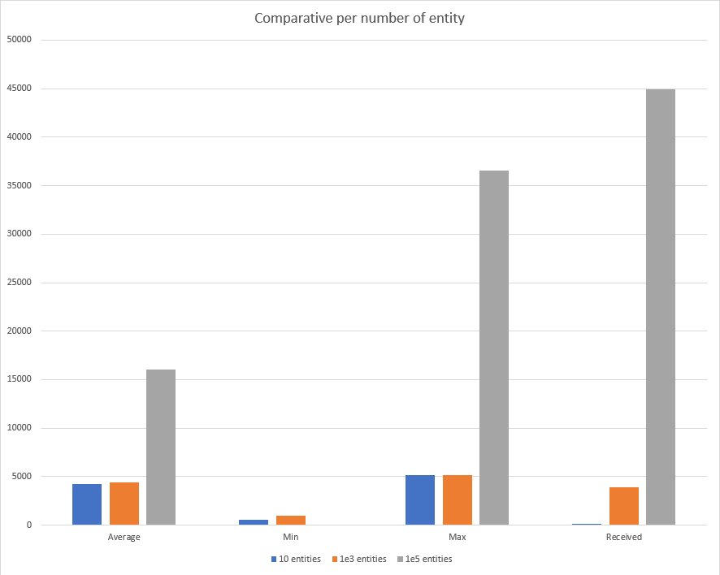

# Tests de performance
Comme demandé dans le CdC, nous avons testé les effets d'une pagination existante - ou non - à l'aide des tests de charge de JMeter
Voici notre méthodologie

### Plan de test
Voici notre plan de tests

Regardons les différents objets :
Thread Group : Un simple thread groupe pour lequel nous allons choisir le nombre de thread qui feront les requêtes suivantes

HTTP Cookie Manager : Ce cookie manager va permettre de conserver la SESSION (donc le login) qui est un cookie

Login : Requête HTTP POST qui soumet une paire de credentials valides à la route /login, ce qui va résulter en la création de la session

Loop Controller : Permet de définir le nombre de fois où la requête GetEntities sera effectuée par chaque thread

Get Entities : Requête HTTP GET sur la route /listwatchinginfo?nb=VALEUR ou VALEUR représente le nombre d'entité que nous souhaitons par page.
Par exemple, si nous voulons la pagination, VALEUR vaudrait 10. Ainsi, 100'000 pages seront crées mais seules les 10 premières entités seront demandée à la DB. Au contraire, si nous souhaitons simuler un manque de pagination, il faudrait mettre VALEUR à 1'000'000, ainsi une seule page avec 1 million d'entité sera retournée. 

Voici les tests effectués. Pour chacun - si applicable - nous avons testé : Le temps de réponse moyen, minimal, maximal et le débit reçu. Les résultats seront présentés plus bas.

Nombre d'entité | Nombre de thread | Nombre d'itération
-- | -- | --
1.E+01 | 5 | 1
1.E+01 | 5 | 10
1.E+01 | 5 | 100
1.E+01 | 10 | 1
1.E+01 | 10 | 10
1.E+01 | 10 | 100
1.E+01 | 50 | 1
1.E+01 | 50 | 10
1.E+01 | 50 | 100
1.E+03 | 5 | 1
1.E+03 | 5 | 10
1.E+03 | 5 | 100
1.E+03 | 10 | 1
1.E+03 | 10 | 10
1.E+03 | 10 | 100
1.E+03 | 50 | 1
1.E+03 | 50 | 10
1.E+03 | 50 | 100
1.E+05 | 5 | 1
1.E+05 | 5 | 10
1.E+05 | 5 | 100
1.E+05 | 10 | 1
1.E+05 | 10 | 10
1.E+05 | 10 | 100
1.E+05 | 50 | 1
1.E+05 | 50 | 10
1.E+06 | 1 | 1

## Méthodologie
Pour notre méthodologie nous avons suivi ces guidelines :
1) Effectuer les tests en mode CLI afin de maximiser les performences
2) Les tests sont exécutés sur l'instance Docker pour se rapprocher d'une infrastructure de production
3) L'infra est régulièrement redémarrée pour éviter les incidences entre tests

/!\ Les tests ont été effectués dans notre VM de développement, ainsi les performences sont moindres.

## Graphiques
### Moyenne

  
### Minimum

### Maximum

### Données reçues

### Comparatif
  

On remarque que lorsque l'on charge 10 ou 1000 entités, le serveur a le même temps de réponse. Par contre lorsque l'on commence à charger 100'000 entités le temps de chargement s'accroît fortement de manière incomensurable. Le nombre de données reçues en (KB/s) augmente car le CSS doit être chargé à chaque fois, ce qui explique son augmentation constante. La valeur minimale, maximale et moyenne est la même pour les 1 millions d'entrées chargées car on effectue le test seulement avec un thread et une itération.